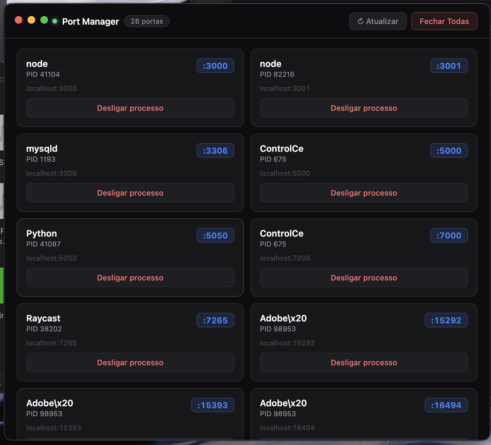

# Port Manager

A lightweight macOS menu bar app to visualize and kill processes running on localhost ports — built with Electron and zero runtime dependencies.

<p align="center">
  
</p>

---

## The Problem

When you work on multiple projects simultaneously, it's easy to lose track of which services are still running. You end up with orphaned Node servers, Python APIs, and databases silently consuming ports — and the only way to find them is digging through `lsof` output or blindly `pkill`-ing processes.

Port Manager solves this with a visual, always-accessible interface that lives in your menu bar.

---

## Features

### 🔎 Full Port Overview
See every process listening on a localhost port, with:
- **Project name** extracted from the process working directory or command path (not just `node` — you see `my-api`, `frontend`, `dashboard`)
- Process name and PID
- The full working directory path (shortened to `~/...`)

### 🗂 Category Filters
Filter ports by type with live counts:

| Filter | What it shows |
|---|---|
| **All** | Everything `lsof` finds |
| **Web / Apps** | `node`, `python`, `ruby`, `go`, `bun`, `deno`, `vite`, `nginx`, and more |
| **Database** | `mysqld`, `postgres`, `mongod`, `redis`, and common DB ports |
| **System** | OS processes, desktop apps, and everything else |

### 🔍 Search
Type a process name or port number to filter in real time — combined with the active category chip.

### ⚡ One-Click Kill
Click **Desligar processo** on any card to `kill -9` the process immediately. The card fades out and the list refreshes automatically.

### 🗑 Kill All Visible
The **Fechar Visíveis** button kills every process currently shown (respects the active filter — e.g. kill only Web/Apps without touching your database).

### 🔄 Auto-Refresh
The list refreshes every 5 seconds automatically. The status bar shows the last update time.

### 🖥 Menu Bar App
Port Manager lives in the macOS menu bar — no Dock icon, no browser tab, no wasted space.

<p align="center">
  
</p>

- **Click** the icon to show/hide the window
- **Right-click** for options including "Start at Login" and "Quit"
- The window appears directly below the menu bar icon
- Closing the window hides it — the app keeps running silently

### 🚀 Start at Login
Enabled automatically on first launch. The app starts hidden on boot and is ready whenever you need it. Toggle it via right-click → "Iniciar no login".

---

## Requirements

- macOS 11 (Big Sur) or later
- [Node.js](https://nodejs.org) 18+

---

## Installation

```bash
# 1. Clone the repo
git clone https://github.com/HeitorWestphal/PortManager-For-Mac.git
cd port-manager

# 2. Install dependencies (only Electron — ~120 MB, one-time)
npm install

# 3. Launch
npm start
```

The app will appear in your menu bar immediately.

> **Double-click launcher:** You can also open `Abrir PortManager.command` from Finder to start the app without a terminal.

---

## How It Works

Port Manager uses two standard macOS system tools — no third-party packages needed at runtime:

| Data | Command |
|---|---|
| Open ports | `lsof -i -P -n \| grep LISTEN` |
| Process command | `ps -p <pids> -o pid=,args=` (batch) |
| Working directory | `lsof -a -p <pids> -d cwd -F pn` (batch) |
| Kill process | `kill -9 <pid>` |

The **project name** displayed on each card is extracted by:
1. Parsing the full command path and stripping noise (`node_modules/.bin`, `/dist`, `/build`, etc.)
2. Falling back to the process's working directory name

All system calls are batched per refresh cycle — one `ps` call and one `lsof` call for all running PIDs at once.

---

## Project Structure

```
port-manager/
├── main.js        # Electron main process — system calls, tray, IPC
├── preload.js     # Context bridge between main and renderer
├── index.html     # UI — filter bar, port grid, kill buttons
└── package.json
```

---

## Platform

macOS only. The app relies on `lsof`, `ps`, and `kill`, as well as macOS-specific Electron APIs (`app.dock.hide()`, `titleBarStyle: 'hiddenInset'`, template tray images).

A Windows port would require replacing those system calls with `netstat -ano`, `wmic process`, and `taskkill /F /PID`.

---

## License

MIT
